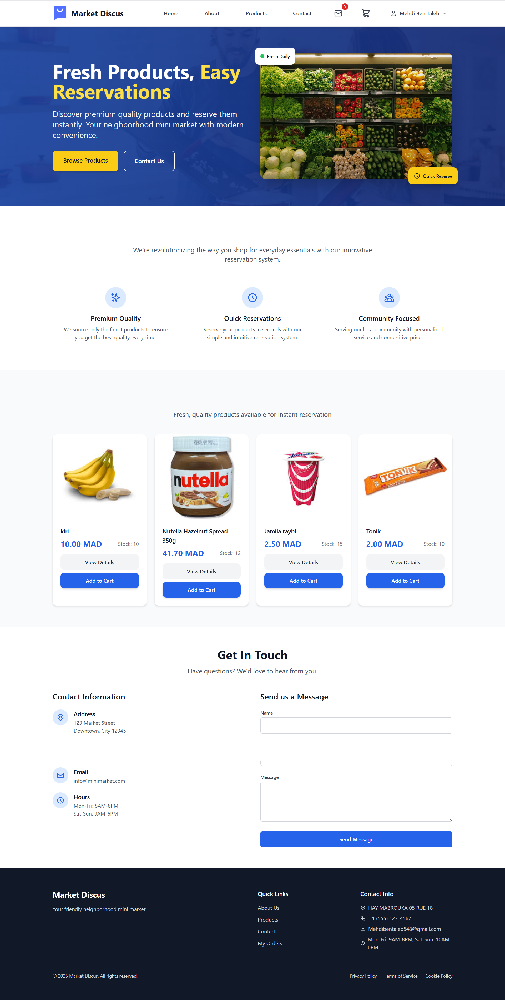
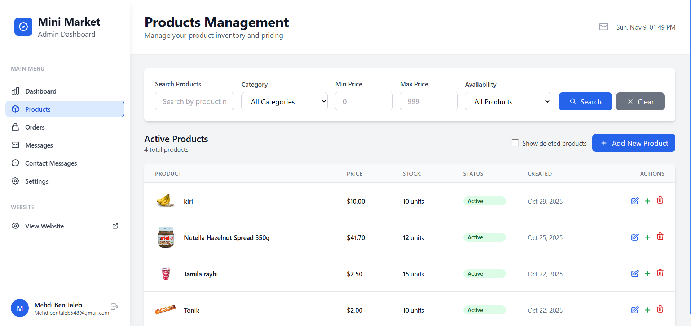
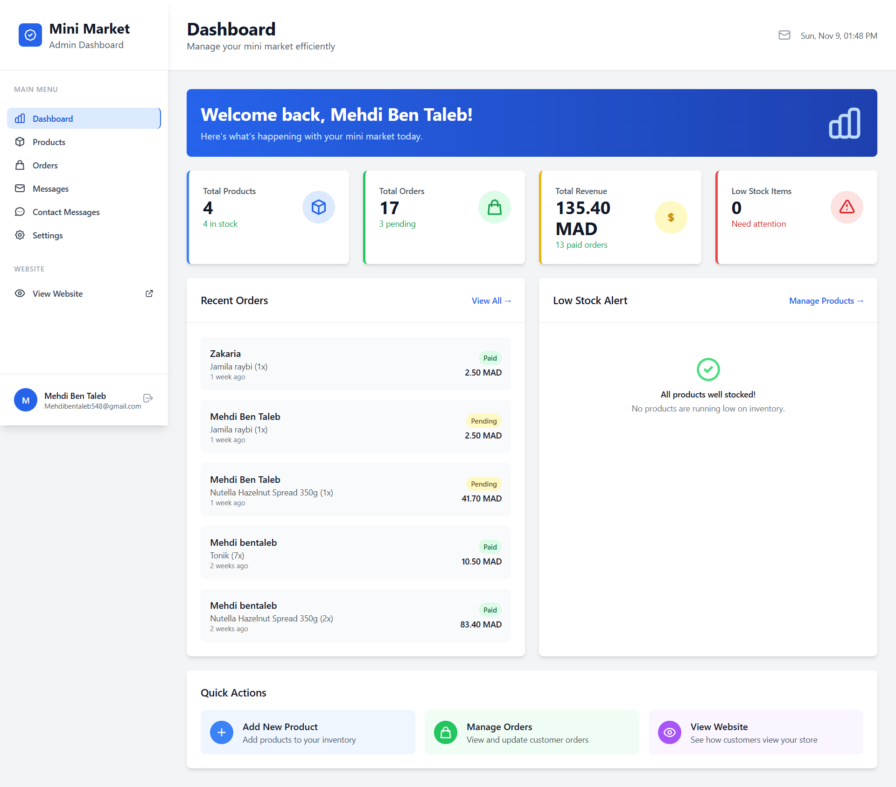
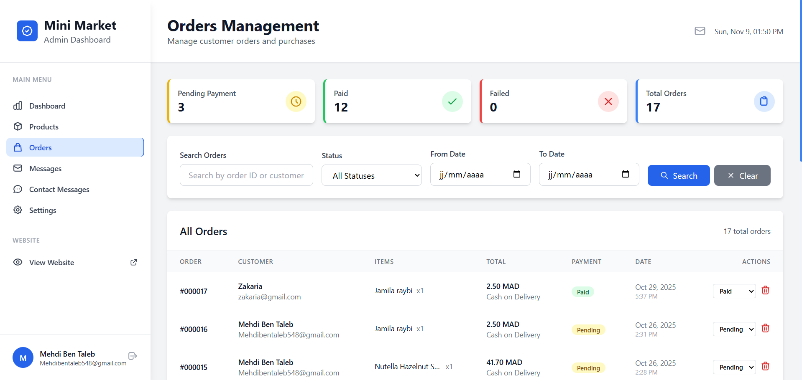

# 🛒 Market Store

**Market Store** is a modern, responsive e-commerce application built with **Laravel** and **TailwindCSS**, designed to provide a seamless shopping experience for users and an intuitive management platform for admins.

---

## ✨ Key Features

- 🛍️ **Product Management:** Add, edit, and delete products with images, descriptions, and prices.  
- 🛒 **Shopping Cart & Checkout:** Smooth shopping experience with real-time cart updates.  
- 📱 **Responsive Design:** Optimized for desktop, tablet, and mobile devices.  
- 🗂️ **Admin Dashboard:** Manage orders, inventory, and user accounts efficiently.  
- 🔒 **User Authentication:** Secure login, registration, and profile management.  
- 📊 **Order & Inventory Tracking:** Monitor stock levels and order statuses in real-time.  
- ⚡ **Fast & Lightweight:** Optimized frontend and backend performance.  

---

## 📸 Screenshots

### Homepage

### Product Page

### Admin Dashboard

### Admin Dashboard

---

## 🛠️ Tech Stack

-  **Laravel**  
-  **TailwindCSS**  
-  **MySQL**  
-  **Blade Templates**  
-  **Composer**  

